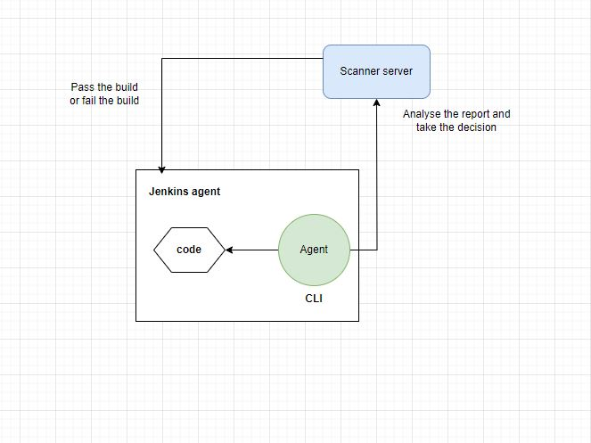

# Jenkins

**Plugins:**
* Pipeline stage view
* AnsiColor
* Pipeline Utility Steps
* Nexus Artifact Uploader
* Rebuilder
* sonarqube scanner

configure aws credentials in jenkins agent also.

Devsecops
-------------

functionality
----------------
no testing, unit testing
unit testing is about testing the functions which are basic blocks of 
programming lang.only developers has to do unit testing.

security
-----------
coding standards ---> dev,qa,uat
static source code analysis --> scan the code, give some recommendations
you must apply the recommendations to pass the build

SAST --->static application security testing--->security related things, analysis will be given to developers
they have to fix

DAST --->dynamic application security testing---->  replicates how attacks are done from outside 
we used veracode for DAST scanning.

open source library scan----> we are getting dependencies from internet (ex in package.json) 
bugs may be present in that. --> libraries scan...-->fix might be like frequently upgrade the libraries..or 
updating patches.

docker images scan---> twistlock, also we have one in aws-eks

after functionality and security , now deploy code to development then perform functional testing ---> developers 
can take care if its micro services and not monolithic application

integration testing:
----------------------
test the entire functionality.testing when all modules are combined in the browser. 
this will be performed by QA

Regression testing, Sanity testing, smoke testing.

We will have Scanner server. This will have an agent. we will install it in jenkins agent because we will 
clone code in it.  agent is an Command line software (like CLI), what agent do to code is... scan the code 
and upload the result to Scanner server.then Scanner server analyse that report and take a decision and 
tell the decision to jenkins agent whether to pass the build or fail the build.

sonarqube runs on 9000 port

username:admin
password: instance id

sonar scanner, sonar CLI, sonar agent ---> all is same

install plugin in jenkins
in tools ----> give name and select install automatically
in manage jenkins--->system configure---> go to sonarqube servers
give name i.e given in tools section and url of sonarqube

for authentication(jenkins has defect so go to sonar url)
 
 my account--->security---> generate token
 name--jenkins
 global analysis token
 no expiration
 generate
 
 
 copy token 
 
 then go to manage jenkins--->credentials--->system--->global credentials--> add credentials--> kind (select secret text)
 -->give copied token in secret ---> give name sonar auth

go again to manage jenkins--> system ---> give authentication token

In sonarqube server we set Quality Gates...
create expense and set as default.
on both overall code and new code
conditions like Coverage(unit testing) 80%, Critical issues 0, Security rating A, Vulnerabilities 0.

once this is passed only build will be done.

when we write quality gate stage jenkins will wait for sonarqube quality report.

for sonarqube to send report to jenkins.,we have to configure webhook in sonar qube 
go to adminstration --->Configuration--->webhooks--->create---> name:jenkins--->
jenkins url: http://jenkins.learningdevopsaws.online:8080/sonarqube-webhook/

